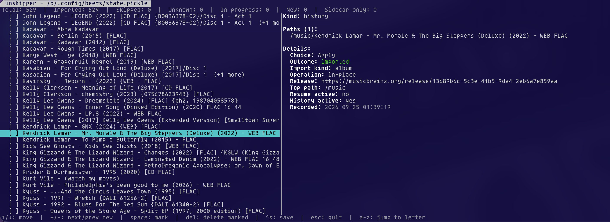

# beets-unskipper

A [beets](https://beets.io) plugin to browse and edit beets' import state
file (`state.pickle`) with a small terminal UI.

Beets records already-imported directories in `state.pickle`, and then any other import with
`--incremental` will skip anything listed in there. `unskipper` lets you browse this
file and remove ("unskip") entries, so beets will reconsider them next time you import.

It also keeps a human-readable sidecar file (`<statefile>.unskipper.json`) with additional data
per item, recorded automatically during import, and that can be used to rebuild a lost
or corrupted `state.pickle`.

<div align="center">

</div>

## Installation

```sh
git clone https://github.com/FlorentLM/beets-unskipper
uv pip install beets-unskipper
```

or with Beets' default `uv tool` install:

```sh
uv tool install beets --with ./beets-unskipper --reinstall
```

Then add `unskipper` to the `plugins` line in your beets config.

## Usage

```sh
beet unskipper
```

| Option                     | Description                                                               |
|----------------------------|---------------------------------------------------------------------------|
| `-s`, `--state-file`       | Path to `state.pickle` (default: beets' configured location)              |
| `-j`, `--unskipper-json`   | Path to the sidecar JSON (default: alongside the state file)              |
| `-r`, `--remap OLD=NEW`    | Remap paths starting with `OLD` to `NEW` when loading                     |
| `--rebuild`                | Rebuild `state.pickle` from the sidecar JSON, then exit                   |
| `--migrate-db`             | With `--remap`, rewrite item/album paths in the beets database, then exit |
| `-d`, `--dry-run`          | With `--rebuild` or `--migrate-db`, preview changes without writing       |

### Moving your music library

If you move your whole library to a new location (new drive, new mount point, etc.),
`--remap` can update everything that beets-unskipper and beets itself track, so incremental
imports and the state UI keep working against the new paths:

```sh
beet unskipper --remap /old/path=/new/path --migrate-db    # rewrite paths in the beets database
beet unskipper --remap /old/path=/new/path --rebuild       # rebuild state.pickle and apply the remap to the sidecar
```

Add `-d`/`--dry-run` to either command to preview what would change without writing anything.

### Keys

| Key               | Action                                             |
|-------------------|----------------------------------------------------|
| `↓`/`↑`           | move                                               |
| `a`-`z`           | jump to next row starting with that letter         |
| `+`/`-`           | jump to next entry marked new (unimported)         |
| `space`           | mark/unmark row                                    |
| `Del`/`Backspace` | delete marked rows (or current one if none marked) |
| `Ctrl+S`          | save                                               |
| `Esc`             | quit                                               |
